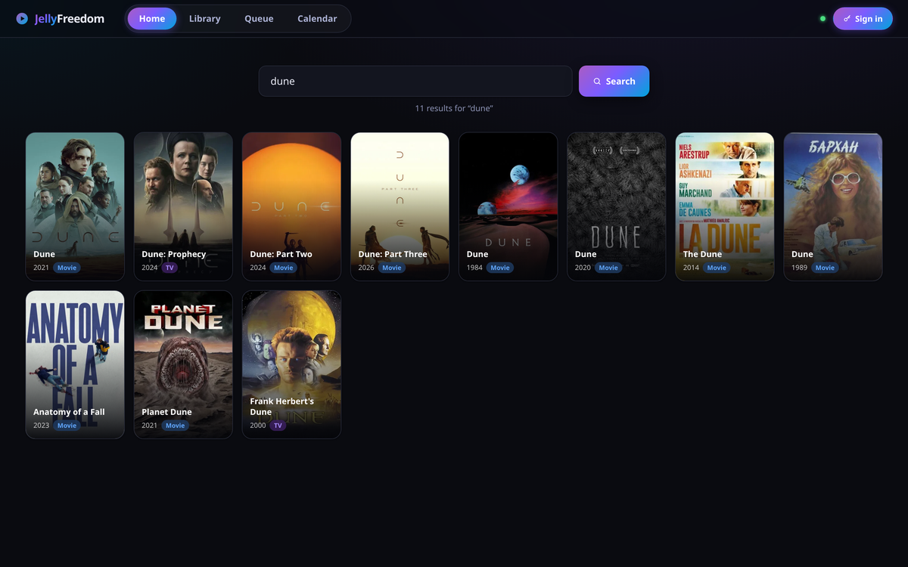
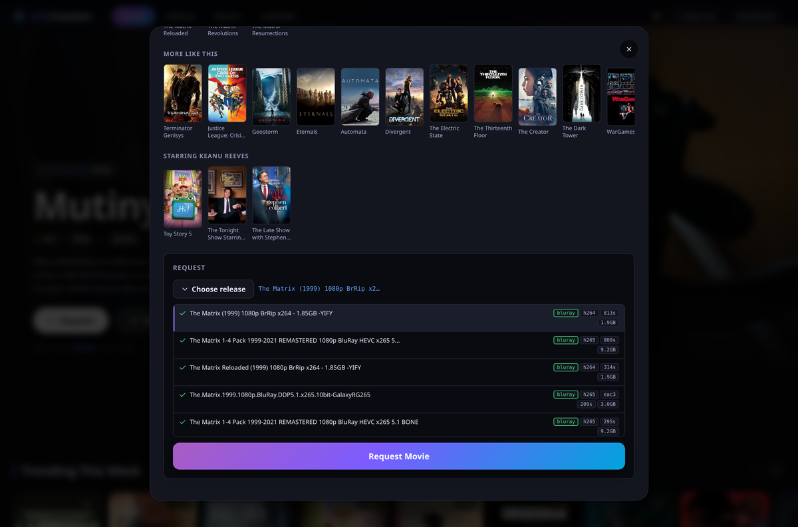
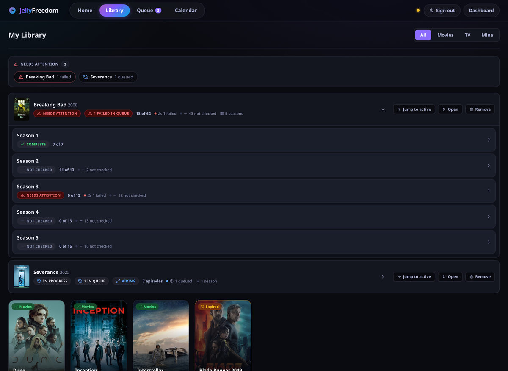
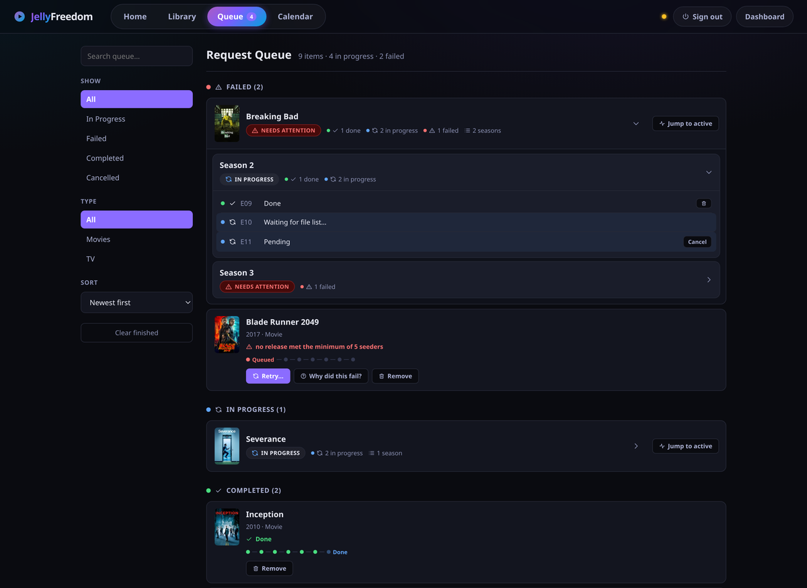
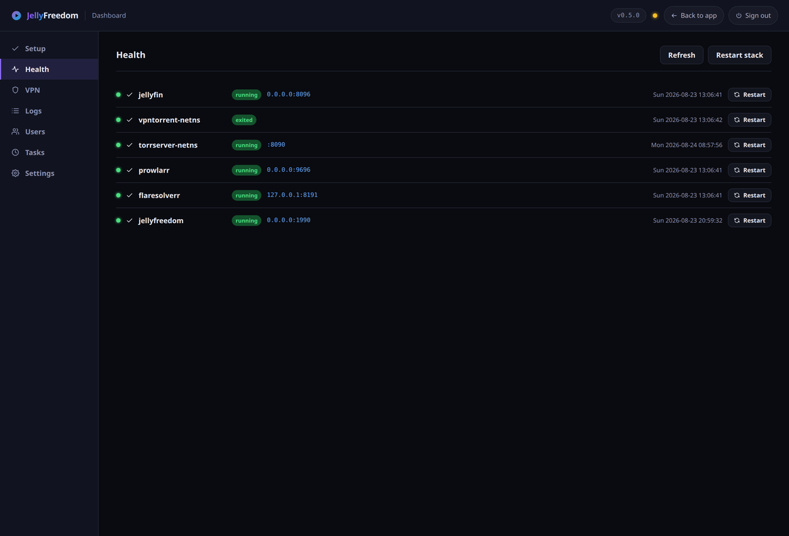

# JellyFreedom

[](https://github.com/MoonTheRipper/JellyFreedom/actions/workflows/ci.yml)
[](https://github.com/MoonTheRipper/JellyFreedom/releases/latest)
[](LICENSE)

**Watch things straight from a torrent, in Jellyfin, without filling up your disk.**

You search for something, pick which file you want, and press play. JellyFreedom streams it
on demand and it shows up in Jellyfin like any other title — on your Apple TV, your phone,
your browser. Nothing is saved to your drive, so it does not matter whether you watch one
film or a hundred: disk usage stays flat.

**You bring the sources.** JellyFreedom has no catalogue and no built-in search of its own.
It looks only in the places *you* add, and plays the files *you* choose — your own
recordings and backups, a public-domain archive, Creative Commons releases, Linux
distributions, or anything else you host or have the right to use.

---

## What it looks like

**Search for something.** Type a name and pick the right title.



**Choose exactly which file you want** — or let it decide for you. Each option shows its
quality, video and audio format, size, and how many people are sharing it, so you can tell
a good file from a bad one at a glance.



**Your library, as a tree.** Shows open into seasons, and seasons into episodes, so you can
see what you have and what is still coming without scrolling through hundreds of rows. A
show that is still airing says *"Up to date"*, never *"Complete"* — so you notice when the
next episode lands.



**Watch things arrive.** The queue is a tree too, and anything that needs you sorts to the
top.



**A dashboard that tells you what is left to do.** Every row links to the thing that fixes
it.



---

## What you need

- **A computer running Debian or Ubuntu** that stays on — a small home server, a mini PC, an
  old laptop. Ubuntu 22.04 and 24.04 are tested.
- **4 GB of memory**, 8 GB if you want room to spare. Streaming uses a fixed 2 GB slice of
  memory as a buffer, and Jellyfin needs its own.
- **A few GB of disk** for the software itself. Not for media — that is the whole point.
- **A WireGuard VPN file** from whichever provider you use, or your own server. This is the
  one thing you have to bring yourself. Pick a server that allows peer-to-peer traffic,
  otherwise connections are made but nothing ever transfers.
- **A free TMDB key** for cover art and descriptions, and at least one search source added
  to Prowlarr. JellyFreedom ships none of these.

x86_64 for now. Raspberry Pi and other arm64 machines are not ready yet.

## Install

One command:

```bash
curl -fsSL https://github.com/MoonTheRipper/JellyFreedom/releases/latest/download/get.sh | sudo bash
```

It picks the right build for your machine and checks it against the official checksums
before installing anything.

Piping a script into `sudo bash` is a real decision, so if you would rather read it first:

```bash
base=https://github.com/MoonTheRipper/JellyFreedom/releases/latest/download
curl -fsSLO "$base/get.sh"
curl -fsSLO "$base/SHA256SUMS"
sha256sum -c SHA256SUMS --ignore-missing   # expect: get.sh: OK
less get.sh                                # read it
sudo bash get.sh
```

The installer sets everything up for you — JellyFreedom itself, the streaming engine,
Jellyfin, and the search layer — each under its own account, with the VPN protection wired
in. Anything you already have installed is left alone.

Later on, `sudo jellyfreedom --update` upgrades in place.

## Getting started

1. Open `http://<your-server>:1990/dashboard/` and **create your account straight away** —
   until you do, that page is open to anyone who can reach the machine.
2. **Settings** → paste in your TMDB key, and the addresses for Prowlarr and Jellyfin.
3. **Prowlarr** (`http://<your-server>:9696`) → add the places you want to search.
4. **VPN → Configurations** → upload your WireGuard file and press **Activate**. Until you
   do, nothing will download at all. That is deliberate, not a fault.
5. In Jellyfin, add the two folders JellyFreedom created as libraries.

Then search for something and press play. The first few seconds of a new title are spent
connecting, after that it plays normally.

## Good to know

- **It is not a download manager.** There is no growing folder of files. What you watch is
  streamed as you watch it, through a buffer that has a hard size limit and physically
  cannot grow past it.
- **It does not come with anything to search.** With nothing added to Prowlarr, it finds
  nothing. That is by design.
- **Keep it on your own network.** It talks plain HTTP and some pages need no password, so
  it belongs on your home network or a private tunnel like Tailscale — not on the open
  internet. See [SECURITY.md](SECURITY.md).
- **It does not replace Radarr or Sonarr**, and does not work alongside them. They are built
  around files existing on a disk; this is built around a file being playable right now.
- **One household, one trusted network.** It is not built for many separate users.
- **No Docker**, and that is not going to change.

## How it works, briefly

Five pieces, and only one of them is ours:

| | |
|---|---|
| **Jellyfin** | The app you actually watch in, on every device |
| **JellyFreedom** | Finds a good file, picks it, and hands the stream to Jellyfin — *this repo* |
| **TorrServer** | Turns a torrent into a normal video stream, using a fixed-size memory buffer |
| **Prowlarr** | Searches the sources you added |
| **WireGuard** | Keeps that traffic private, and blocks it entirely if the tunnel drops |

Instead of saving a file and pointing Jellyfin at it, JellyFreedom writes a tiny pointer.
When you press play, it finds the best *currently available* copy and streams that. So a
title in your library does not go stale when whoever was sharing it disappears — it just
finds another one next time.

## Documentation

| | |
|---|---|
| [Install guide](docs/install.md) | Prerequisites, what the installer does, updating, uninstalling |
| [First run](docs/first-run.md) | Fresh install to first playback, in order |
| [Configuration](docs/configuration.md) | Every setting, its default, and what it changes |
| [Troubleshooting](docs/troubleshooting.md) | Symptom to fix, starting with `jellyfreedom doctor` |
| [FAQ](docs/faq.md) | Short answers to the questions people actually ask |
| [Security &amp; privacy](docs/security.md) | What goes through the tunnel, and how to check it |
| [SECURITY.md](SECURITY.md) | Threat model, which pages need a password, the privilege boundary |
| [CONTRIBUTING.md](CONTRIBUTING.md) | Build, test, and how to try the installer safely |
| [CHANGELOG.md](CHANGELOG.md) | What changed in each release |
| [Architecture](docs/dev/architecture.md) | How it is put together, and why |
| [Decisions](docs/dev/decisions.md) | The reasoning behind the major choices |
| [Operations](docs/dev/operations.md) | VPN details, buffer tuning, Jellyfin and Apple TV setup |
| [Roadmap](docs/dev/roadmap.md) | What is genuinely still open |
| [Project website](https://moontheripper.github.io/JellyFreedom/) | Overview |

## Your files, your responsibility

JellyFreedom includes no sources, no catalogue, and no content. It searches only what you
add to it and plays only what you point it at. What you choose to search for and play, and
whether you have the right to, is up to you.

Not affiliated with or endorsed by the Jellyfin, Prowlarr, TorrServer, FlareSolverr, TMDB,
or WireGuard projects. All trademarks belong to their respective owners.

## Licence

[MIT](LICENSE). Provided **as is**, without warranty of any kind.
